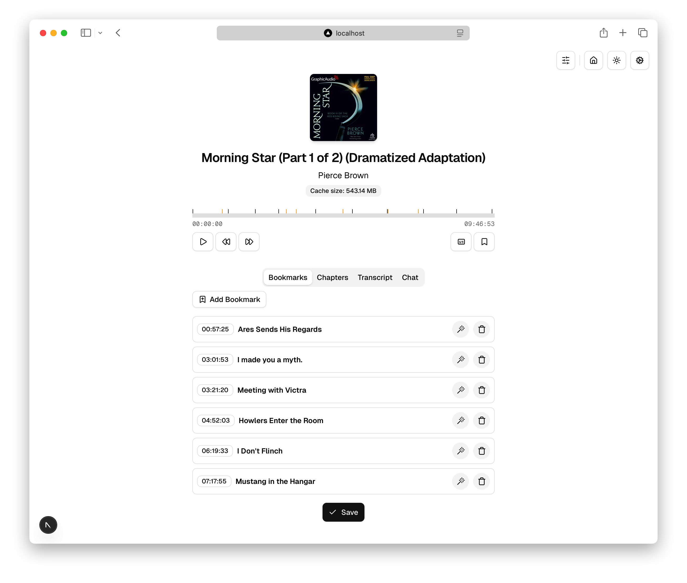

<div align="center">
    
    <h1>AudioScribe</h1>
</div>

A companion app for [Audiobookshelf](https://www.audiobookshelf.org/) that helps to enhance audiobook experience with AI bookmark title suggestions, transcription, chat and more.

See [Youtube Demo](https://youtu.be/zyr6M5ebI38)



## Features

- **AI Suggestions**: Generate meaningful bookmark titles using LLM's
- **Transcription**: Transcribe audiobook
- **Captions**: View generated captions for your audiobooks
- **Multiple AI Providers**: Support for OpenAI, Google Gemini, Claude, and local Ollama models
- **Manual Bookmarking**: Easily rename and manage your own bookmarks

### Transcription

- Audio transcription is powered by OpenAI's Whisper model

## Prerequisites

- An Audiobookshelf server with API access
- API keys for AI providers (Ollama, Gemini, OpenAI)

### Installation

<details>
<summary>Local</summary>

#### System Dependencies

```sh
brew install ffmpeg
brew install cmake
```

#### Ollama

```sh
 # Embedder
ollama pull all-minilm:latest

ollama pull llama3.2:3b
```

#### Install

```sh
clone git@github.com:shakogegia/audioscribe.git
cd audioscribe
npm install

# set env variables
cp .env.example .env
```

#### Run

```sh
npm run dev

# or
npm run build
npm run start

```

</details>

<details>
<summary>Docker</summary>

Create a `docker-compose.yml` file:

```yaml
version: "3.8"

services:
  audioscribe:
    image: shakogegia/audioscribe:latest
    container_name: audioscribe
    ports:
      - 3000:3000
    restart: unless-stopped
    user: "1000:1000" # Match your host user UID:GID
    volumes:
      - ./app-data:/app/data # Persist config files
```

Then run:

```sh
docker-compose up -d
```

### Portainer Configuration

If using Portainer, create a stack with:

```yaml
audioscribe:
  image: shakogegia/audioscribe:latest
  container_name: audioscribe
  ports:
    - 3000:3000
  restart: unless-stopped
  volumes:
    # Persist application data including database, audio files, and configuration
    - /path/to/your/data:/app/data
```

</details>

## Demo

<details>
<summary>Screenshots</summary>


</details>

## License

This project is licensed under the MIT License - see the [LICENSE](LICENSE) file for details.

## Acknowledgments

- [Audiobookshelf](https://www.audiobookshelf.org/) - Amazing audiobook server
- [OpenAI Whisper](https://github.com/openai/whisper) - Speech recognition model
- [Next.js](https://nextjs.org/) - React framework
- [Tailwind CSS](https://tailwindcss.com/) - Styling framework
