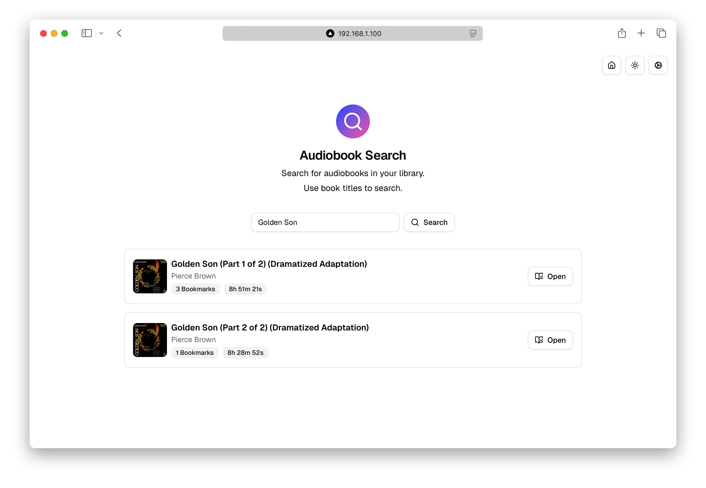
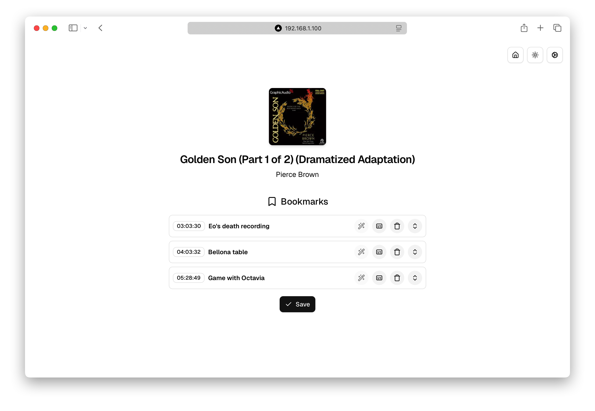
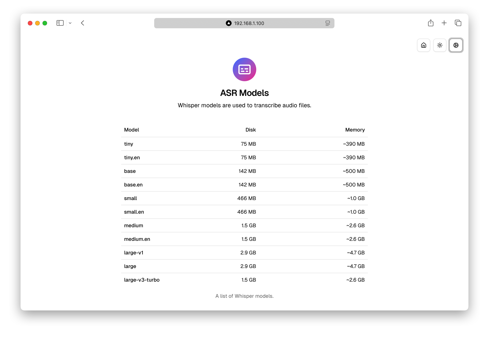

<div align="center">
    
    <h1>AudioScribe</h1>
</div>

A companion app for [Audiobookshelf](https://www.audiobookshelf.org/) that helps to enhance audiobook experience with AI bookmark title suggestions, transcription, chat and more.

> [!NOTE]  
> This project is purely an experiment. I’m not sure where it’s headed, how it will evolve, or even if it’s useful or needed at all.  
> For now, it’s just a playground to explore ideas around audiobooks + AI assistance
> Feel free to try it out or share feedback


See [Youtube Demo](https://youtu.be/zyr6M5ebI38)


## Features

- **Bookmark Suggestions**: Generate meaningful bookmark titles using LLM's
- **Transcription**: Transcribe audiobook
- **Captions**: View generated captions for your audiobooks
- **Multiple AI Providers**: Support for OpenAI, Google Gemini, Claude, and local Ollama models
- **Manual Bookmarking**: Easily rename and manage your own bookmarks

## Prerequisites

- An Audiobookshelf server with API access
- API keys for AI providers (Ollama, Gemini, OpenAI)

### Installation

<details>
<summary>Local</summary>

#### System Dependencies

```sh
brew install ffmpeg
brew install cmake
```

#### Setup

Clone repository, install npm dependencies and set env variables

```sh
# Clone repo and install npm dependencies
clone git@github.com:shakogegia/audioscribe.git
cd audioscribe
npm install
cp .env.example .env
```

#### Run

```sh
npm run dev

# or
npm run build && npm run start
```

</details>

<details>
<summary>Docker</summary>

Create a `docker-compose.yml` file:

```yaml
version: "3.8"

services:
  audioscribe:
    image: shakogegia/audioscribe:latest
    container_name: audioscribe
    ports:
      - 3000:3000
    restart: unless-stopped
    user: "1000:1000" # Match your host user UID:GID
    volumes:
      - /path/to/data:/app/data # Persist application data including database, audio files, and configuration
```

Then run:

```sh
docker-compose up -d
```

</details>

## Demo

<details>
<summary>Screenshots</summary>






</details>

## License

This project is licensed under the MIT License - see the [LICENSE](LICENSE) file for details.
